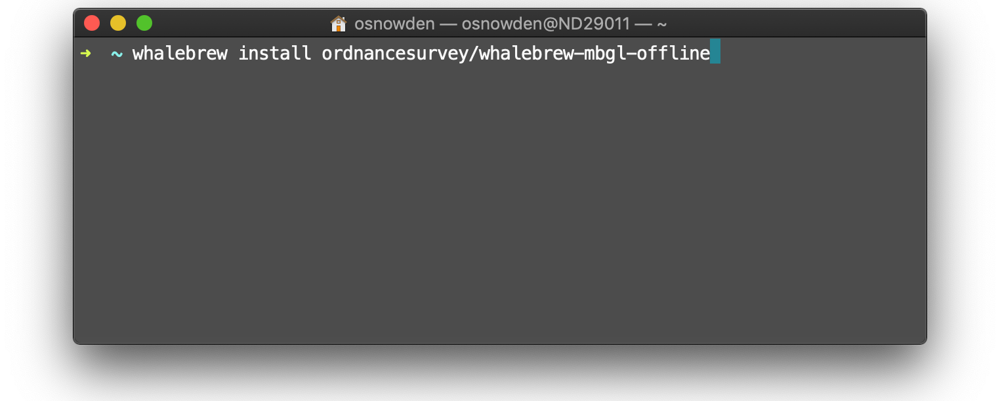
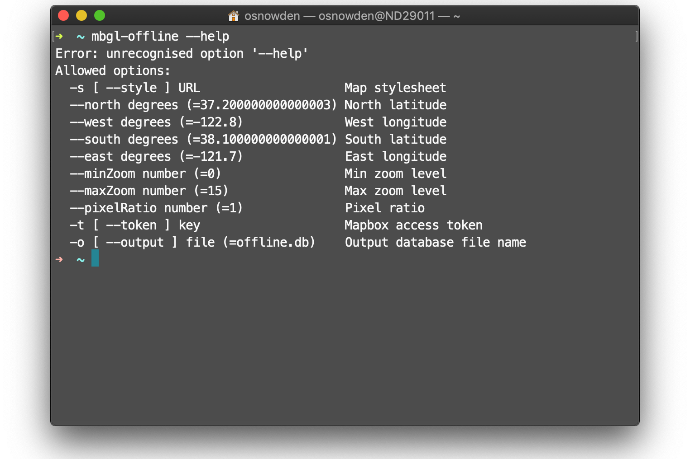

# mbgl-offline command 

The mbgl-offline command enables you to create offline [Mapbox GL Native](https://github.com/mapbox/mapbox-gl-native) map packages.  This is useful for creating preprocessed offline map packages for mobile devices. 

To simplify installation, a [whalebrew](https://github.com/whalebrew/whalebrew) Docker based container is provided.

Note: the [mbgl-offline docker hub container](https://hub.docker.com/r/ordnancesurvey/whalebrew-mbgl-offline) is built automatically from this repo.

